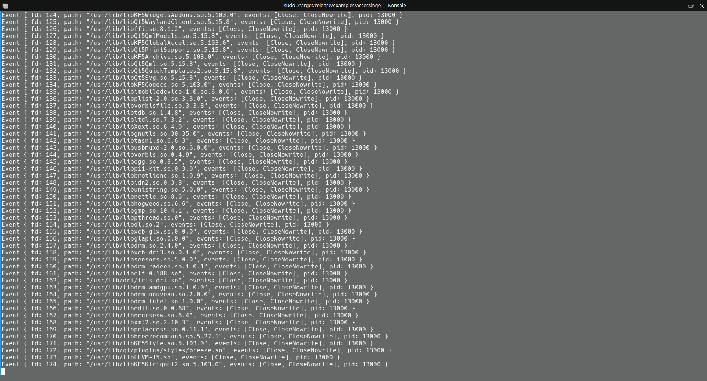

# WatchMyFile
Monitor file events in realtime on Linux only.

# Use
See [example](examples/accessingo.rs)

# Test
Build the example with `cargo build --release --example accessingo` 

run `sudo ./target/release/examples/accessingo`

# Screen
